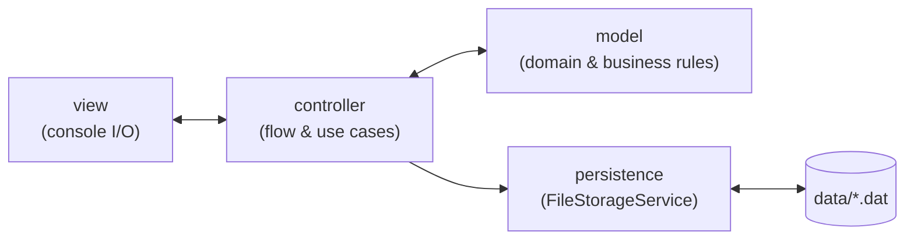

<h1 align="center">SpotifUM</h1>

<p align="center">
  A console-based music streaming platform simulation, built in Java to practice<br/>
  object-oriented design, clean architecture, and test-driven development.
</p>

<p align="center">
  
  
  
  
</p>

---

SpotifUM simulates a Spotify-like streaming service entirely in the terminal: accounts, subscription
tiers, a track catalog, four different playlist strategies, a loyalty points system, and a leaderboard.
It doesn't play actual audio — the goal was never audio playback, it was **designing a small system
the right way**: clear layering, immutable data where it matters, defensive copying, and a domain
model that reads like the problem it's solving.

## Features

- **Accounts & subscriptions** — sign up / log in, three tiers (`FREE`, `PREMIUM`, `PREMIUM_PLUS`)
  each with different playback rewards and feature access, enforced by the domain model rather than
  scattered `if` checks in the UI.
- **Playback & loyalty points** — every play is tracked; points accrue using a formula that depends
  on the listener's plan (flat rate for Free/Premium, compounding for Premium+).
- **Four playlist strategies**, each a `Playlist` subclass with its own construction rules:
  - **Custom** — hand-picked tracks, optional shuffle on playback.
  - **Random Mix** — auto-generated from a random sample of the catalog.
  - **Genre & Duration** — manually curated, constrained to one genre and a total time budget.
  - **Favorites** — maintained automatically as the listener favorites tracks during playback.
- **Albums & personal library** — browse a small album catalog and add albums to a Premium-only
  personal library.
- **Leaderboard** — most played song, most listened-to artist, most played genre, most active listener.
- **Persistence** — application state (users, catalog, albums) is serialized to disk and reloaded on
  the next run; a sample dataset is seeded automatically the first time the app starts.

## Architecture

The codebase follows an MVC-style layering with a dedicated persistence layer, so business rules,
console I/O, and disk I/O never bleed into each other:

```
com.spotifum
├── model/        domain classes: User, Song, Album, Playlist (+4 subclasses),
│                 SubscriptionPlan, UserRepository, MusicCatalog, AlbumCatalog
├── persistence/   FileStorageService — Java serialization to/from disk
├── controller/    orchestrates flow between views, the model, and persistence
├── view/          console rendering and input collection only — no business logic
└── SpotifUmApplication   composition root: seeds/loads state, runs the menu loop, single exit point
```



Every screen is a plain loop in its controller: "go back" is a `return`, "go forward" is a nested
call that loops and eventually returns. There is no recursive re-entry into the menu system, so a
long-running session can't grow the call stack unbounded — a real issue in the original prototype
this project evolved from.

### Design patterns

| Pattern | Where | Why |
|---|---|---|
| **Singleton** | `UserRepository` | One authoritative, in-memory directory of accounts for the process lifetime. |
| **Builder** | `Song.Builder` | `Song` has several optional attributes (label, lyrics, genre...); a builder keeps construction readable instead of a telescoping constructor. |
| **Prototype** (`clone()`) | `Song`, `Album`, `Playlist` subclasses, `User` | Deep copies are taken whenever an object crosses into a collection (e.g. adding a song to a playlist), so the catalog and a user's personal copy never alias each other. |
| **Strategy via enum** | `SubscriptionPlan` | Point-earning formulas and feature-access rules live as behavior on the enum constants instead of `switch` statements duplicated across controllers. |
| **Template-ish polymorphism** | `Playlist` (abstract) + 4 subclasses | Each playlist type defines how it's built and describes itself (`getKind()`), while shared behavior (duration totals, `toString`) lives once in the base class. |

## Tech stack

- **Java 17**
- **Maven** for builds and dependency management
- **JUnit 5** for unit tests
- **GitHub Actions** for CI (`.github/workflows/ci.yml` runs `mvn verify` on every push/PR)

## Getting started

**Requirements:** JDK 17+ and Maven 3.8+.

```bash
# Run the test suite
mvn test

# Build the runnable jar
mvn package

# Launch the app
java -jar target/spotifum.jar
```

On first launch, SpotifUM seeds a sample catalog (10 songs across 6 genres, 3 albums) and a default
admin account (`admin@spotifum.com`) under `data/`. That folder is regenerated on demand and isn't
committed to the repository.

## Testing

Unit tests cover the domain model — the layer with the actual business rules: subscription
behavior, points calculation, playlist construction and cloning, favorites tracking, and the user
repository. Run them with `mvn test`.

## Project structure

```
.
├── pom.xml
├── src
│   ├── main/java/com/spotifum
│   │   ├── model/
│   │   ├── persistence/
│   │   ├── controller/
│   │   ├── view/
│   │   └── SpotifUmApplication.java
│   └── test/java/com/spotifum/model/
└── .github/workflows/ci.yml
```

## Known limitations

This remains a learning project and is upfront about it:

- Playback is simulated (prints to the console) — there's no real audio.
- Persistence is plain Java serialization to flat files, not a database; fine for a single-process
  CLI tool, not for concurrent access.
- There's no authentication beyond an email lookup — acceptable for a course project, not for
  production.

Natural next steps if this grew further: a Spring Boot REST API over the same domain model, a real
datastore (Postgres) behind the repository interfaces, and a proper password/auth layer.

## License

Released under the [MIT License](LICENSE).
