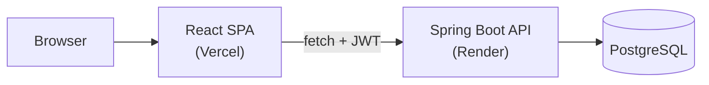

<h1 align="center">SpotifUM</h1>

<p align="center">
  A Spotify-style streaming platform: a Spring Boot REST API backed by PostgreSQL,<br/>
  a React SPA frontend, and the original Java domain model that started it all.
</p>

<p align="center">
  <a href="https://spotifum.vercel.app"><strong>Live demo</strong></a>
  ·
  <a href="https://github.com/TurnGui/spotifum/actions/workflows/ci.yml"><strong>CI</strong></a>
</p>

<p align="center">
  
  
  
  
  
  
  
</p>

---

SpotifUM started as a university assignment: a console-only Java application built to practice
object-oriented design, clean layering, and test-driven development. I later rebuilt it as a
full-stack product, a Spring Boot REST API with JWT auth and a PostgreSQL database plus a React
frontend on top, and deployed both, to turn a class project into something closer to real software.

It simulates a streaming service: accounts with subscription tiers, a track catalog, playlists,
a loyalty-points system, and a leaderboard. It doesn't play real audio; the point was never audio
playback, it was designing a small system the right way.

**[spotifum.vercel.app →](https://spotifum.vercel.app)** (API cold-starts on the free Render tier,
so the first request after a while can take ~30s)

## Features

- **Accounts & subscriptions**: register/login with JWT auth (BCrypt-hashed passwords), three tiers
  (`FREE`, `PREMIUM`, `PREMIUM_PLUS`) with different playback rewards and feature access.
- **Playback & loyalty points**: every play is tracked; points accrue using a formula that depends
  on the listener's plan (flat rate for Free/Premium, compounding for Premium+).
- **Playlists**: create playlists, add/remove songs, browse the catalog by genre.
- **Album catalog**: browse albums and their artists/years.
- **Leaderboard**: most played song, most listened-to artist, most active listener.
- **Persistence**: PostgreSQL via Spring Data JPA, seeded with sample data on first boot.

## Live deployment

| Layer | Service | URL |
|---|---|---|
| Frontend | Vercel | [spotifum.vercel.app](https://spotifum.vercel.app) |
| API | Render | `spotifum-api.onrender.com` |
| Database | Managed PostgreSQL | n/a |



## Tech stack

| | |
|---|---|
| **Backend** | Java 17 · Spring Boot 4 · Spring Security · Spring Data JPA · JWT (jjwt) · Maven |
| **Frontend** | React 19 · Vite · React Router · Tailwind CSS |
| **Database** | PostgreSQL 16 |
| **DevOps** | Docker · GitHub Actions CI · deployed on Vercel (frontend) + Render (API) |
| **Testing** | JUnit 5 |

## Architecture

This is a monorepo with three Maven/npm modules:

```
spotifum
├── spotifum-core        original domain model + console app (the uni project):
│                         design-pattern-heavy OOP, no framework, fully unit-tested
├── spotifum-api          Spring Boot REST API: JPA entities, JWT auth, business services
└── spotifum-frontend     React SPA that consumes the API
```

`spotifum-core` is kept as-is: a standalone, runnable console app and the place where the object
design (see below) lives and is unit-tested in isolation from any framework. `spotifum-api` is a
separate Spring Boot service with its own JPA-mapped model, built to expose the same kind of
domain over HTTP for the web app.

### API overview

All endpoints are prefixed with the API's base URL. Every route requires a `Bearer` JWT except
`POST /auth/register` and `POST /auth/login`.

| Method | Endpoint | Description |
|---|---|---|
| POST | `/auth/register` | Create an account |
| POST | `/auth/login` | Authenticate, returns a JWT |
| GET | `/users/me` | Current user's profile |
| PUT | `/users/me` | Update current user's profile |
| GET | `/songs` | List all songs |
| GET | `/songs/{id}` | Get a song |
| GET | `/songs/genre/{genre}` | List songs by genre |
| POST | `/songs/{id}/play` | Record a play, award loyalty points |
| GET | `/albums` | List all albums |
| GET | `/albums/{id}` | Get an album |
| GET | `/playlists` | List current user's playlists |
| GET | `/playlists/{id}` | Get a playlist |
| POST | `/playlists` | Create a playlist |
| POST | `/playlists/{playlistId}/songs/{songId}` | Add a song to a playlist |
| DELETE | `/playlists/{playlistId}/songs/{songId}` | Remove a song from a playlist |
| DELETE | `/playlists/{id}` | Delete a playlist |
| GET | `/leaderboard` | Most played song / top artist / most active listener |

### Design patterns (spotifum-core)

The original domain model is where the OOP design work lives:

| Pattern | Where | Why |
|---|---|---|
| **Singleton** | `UserRepository` | One authoritative, in-memory directory of accounts for the process lifetime. |
| **Builder** | `Song.Builder` | `Song` has several optional attributes (label, lyrics, genre...); a builder keeps construction readable instead of a telescoping constructor. |
| **Prototype** (`clone()`) | `Song`, `Album`, `Playlist` subclasses, `User` | Deep copies are taken whenever an object crosses into a collection, so the catalog and a user's personal copy never alias each other. |
| **Strategy via enum** | `SubscriptionPlan` | Point-earning formulas and feature-access rules live as behavior on the enum constants instead of `switch` statements duplicated across controllers. |
| **Template-ish polymorphism** | `Playlist` (abstract) + 4 subclasses | Each playlist type (Custom, Random Mix, Genre & Duration, Favorites) defines how it's built, while shared behavior lives once in the base class. |

## Getting started

**Requirements:** JDK 17+, Maven 3.8+, Node 18+, Docker (for a local Postgres instance).

```bash
# 1. Start Postgres
docker compose up -d

# 2. Run the API (from the repo root, it's part of the Maven reactor)
mvn spring-boot:run -pl spotifum-api -am

# 3. Run the frontend
cd spotifum-frontend
npm install
npm run dev
```

The frontend defaults to `http://localhost:8080` for the API (override with a `VITE_API_URL` env
var if needed; see `spotifum-frontend/.env.production` for the deployed value). The API defaults
to the local Postgres started by `docker-compose.yml` (`spotifum` / `spotifum` / `spotifum`).

To run the original console app instead:

```bash
mvn package -pl spotifum-core -am
java -jar spotifum-core/target/spotifum-core-1.0-SNAPSHOT.jar
```

### Environment variables (API)

| Variable | Default | Purpose |
|---|---|---|
| `DATABASE_URL` | `jdbc:postgresql://localhost:5432/spotifum` | JDBC connection string |
| `DATABASE_USERNAME` | `spotifum` | DB user |
| `DATABASE_PASSWORD` | `spotifum` | DB password |
| `JWT_SECRET` | *(dev default, change in prod)* | HMAC signing key for JWTs |
| `PORT` | `8080` | Server port |

## Testing

```bash
mvn verify
```

Runs the full reactor: `spotifum-core`'s domain-model tests (subscription behavior, points
calculation, playlist construction and cloning, favorites tracking, the user repository) and
`spotifum-api`'s service-layer tests (auth, catalog, leaderboard), against a real Postgres instance
in CI.

## Known limitations

- No real audio playback: plays are simulated and only affect points/leaderboard state.
- No refresh-token flow; JWTs are long-lived (24h) rather than rotated.
- No password reset / email verification flow.
- `spotifum-core` and `spotifum-api` maintain separate domain models rather than sharing one,
  a deliberate split so the original console app stays framework-free, but it does mean some
  logic (e.g. points calculation) is duplicated between the two.

## License

Released under the [MIT License](LICENSE).
